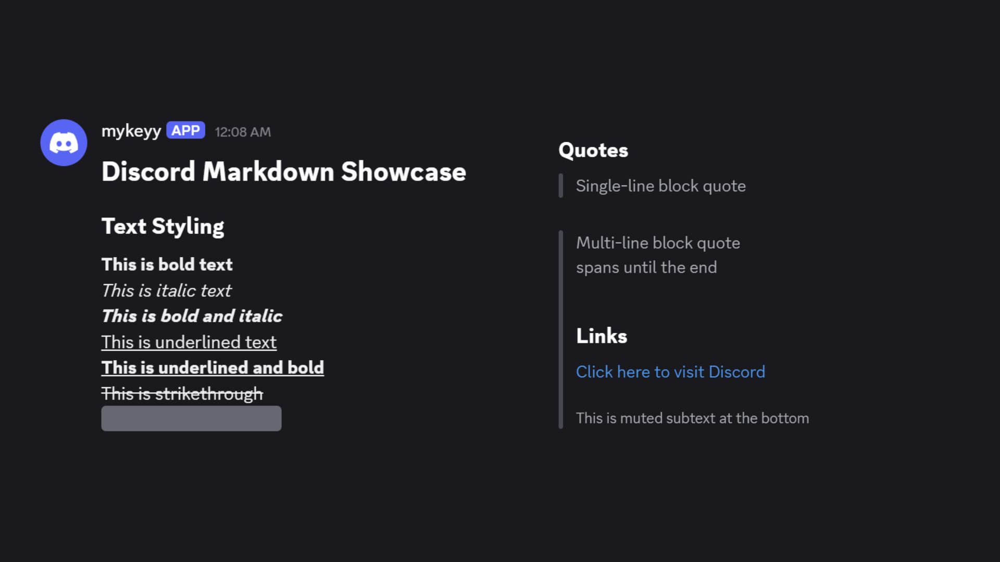
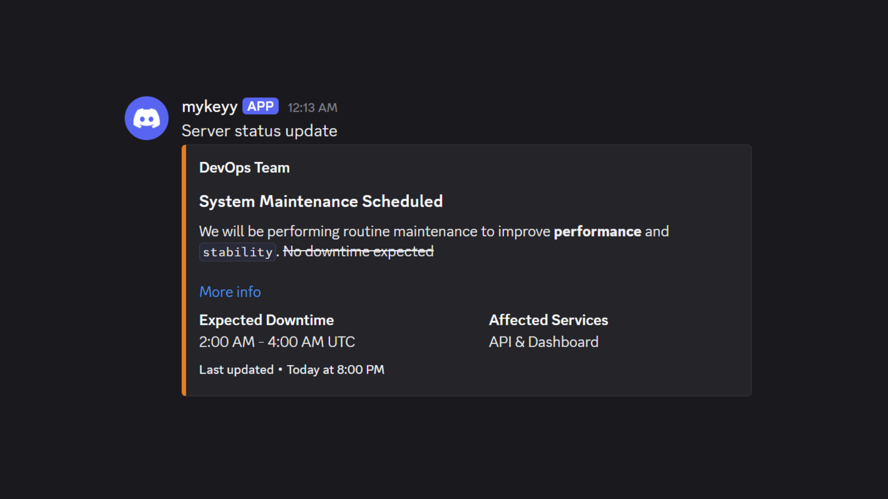
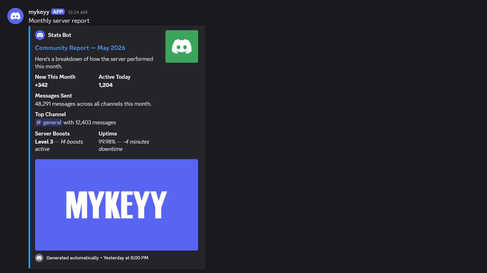

# Discord Markdown Skill

A comprehensive reference guide for Discord's Markdown formatting system.

## Overview

This skill covers all Discord Markdown features:

- **Text formatting** — bold, italic, underline, strikethrough, spoilers
- **Headers & subtext** — section titles and muted text
- **Lists** — ordered, unordered, and nested
- **Code blocks** — inline and multiline with syntax highlighting
- **Block quotes** — single-line and multi-line
- **Masked links** — hyperlinks with custom labels
- **Timestamps** — dynamic, timezone-aware dates
- **Mentions** — users, roles, channels, and special IDs
- **Webhook payloads** — JSON structure for bot/webhook messages and embeds

## Screenshots

### 1. Plain Message (No Embed)

Simple text-only message sent via webhook.

### 2. Basic Embed

Message with a single embed containing a description and color.

### 3. Rich Embed

Full embed with fields, author, footer, and timestamp.

## Usage

Drop the `SKILL.md` into your agent's skills directory, or use it as a reference when writing Discord-formatted content.

## Made by mykeyy
